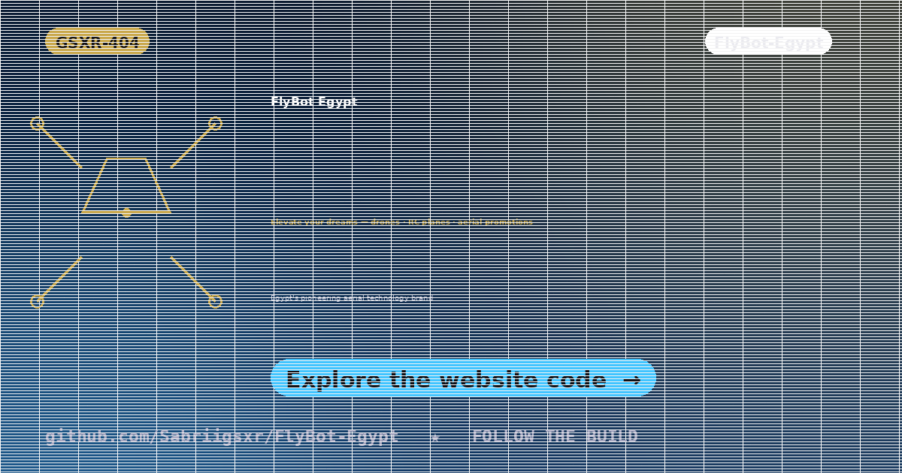

<p align="center">
  
</p>

<h1 align="center">🚁 FLYBOT EGYPT — Elevate Your Dreams</h1>

<p align="center">
  Egypt's pioneering aerial technology brand — RC drones, RC planes, aerial promotions,
  paramotoring & custom builds. This repo is the full website platform.
</p>

<p align="center">
  
  
  
  
  
</p>

---

## ✨ What is FlyBot Egypt?

**FlyBot Egypt** turns aerial dreams into reality. This repository contains the complete
marketing + rental platform for the brand: a fast, modern, fully responsive website that
showcases drones & RC planes, powers an online rental flow, and engages the community
with contests, reviews and a blog.

> 🎯 **Tagline:** *"Elevate Your Dreams"*

## 🧩 Features

| Feature | What it does |
|---|---|
| 🎬 **Interactive Scrolling** | Dynamic scroll-driven product showcase with engaging visuals |
| 🛒 **Product Showcase** | Drone & RC plane models with detailed specs & benefits |
| 🔁 **Rental Platform** | User-friendly web app for drone / RC plane rentals |
| 🛠️ **Custom Build Assistance** | Guides & resources for building custom RC planes & paramotors |
| 👥 **Membership Portal** | Exclusive content & services for registered members |
| ⭐ **Reviews & Testimonials** | Customer feedback to build trust & credibility |
| 📝 **Blog Section** | Industry news, tutorials & community stories |
| 📞 **Contact & Support** | Easy access to customer service & support |
| 📱 **Responsive Design** | Mobile-friendly, accessible on every device |
| 🎮 **Contests Engine** | Photo contest, DIY challenge, caption contest, trivia, referral rewards |

## 🚀 Quick Start

### Option A — Docker (recommended)

```bash
docker compose up -d
# → http://localhost:80
```

### Option B — Static hosting (no build step)

```bash
# just serve the folder
python3 -m http.server 8080
# → http://localhost:8080
```

### Option C — nginx (production)

```bash
# the repo ships a ready-to-use nginx.conf + Dockerfile
docker build -t flybot-egypt .
docker run -d -p 80:80 flybot-egypt
```

## 📂 Structure

```
FLYBOT/
├── index.html          # Landing page (scroll-driven hero + showcase)
├── scan.html           # QR-scan landing (rental check-in / events)
├── download.html       # App / brochure download hub
├── assets/
│   ├── css/style.css   # Design system
│   ├── js/main.js      # Interactions, scroll effects, forms
│   └── preview/        # Site previews & QR assets
├── Dockerfile          # Production container (nginx)
├── nginx.conf          # Server config (gzip, caching, SPA)
└── docker-compose.yml  # One-command dev/prod stack
```

## 🎯 Community Ideas (built into the brand playbook)

- 📸 **Photo Contest** — best aerial shot wins a prize
- 🛩️ **DIY Challenge** — design your own RC plane / drone
- 💬 **Caption Contest** — fun + engagement
- 🧠 **Trivia Quiz** — drones & aviation knowledge
- 🎁 **Referral Contest** — rewards for bringing friends

## 🗺️ Roadmap

- [ ] Online rental checkout + payments
- [ ] Membership dashboard
- [ ] Arabic / RTL localization
- [ ] Instagram feed integration
- [ ] Live drone telemetry demos

## 👤 Author

**Ahmed Sabry (GSXR-404)** — AI researcher · cybersecurity ninja · freight-tech builder

- GitHub: [@Sabriigsxr](https://github.com/Sabriigsxr)
- Brand: [FlyBot Egypt](https://instagram.com/flybot.eg)

## 📄 License

MIT — free to use, learn from, and build upon.
